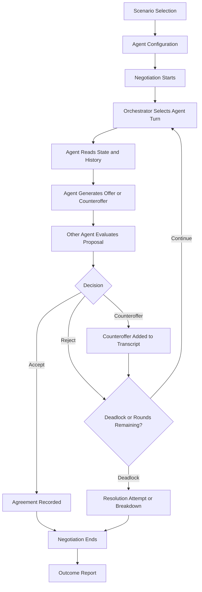

# Multi-Agent Negotiation Simulator

## Friday Deliverables

### 1. Core System Concept

Negotiation is a structured exchange in which two or more parties try to reach an agreement while protecting their own interests. Each party has objectives, limits, information, and a preferred way of communicating.

#### What multi-agent negotiation means

A multi-agent negotiation system contains several autonomous software agents. Each agent represents a stakeholder and makes decisions from its own role, goals, constraints, negotiation history, and personality. Agents do not simply follow one shared script: they evaluate the latest proposal and decide whether to accept it, reject it, or make a counteroffer.

The **Orchestrator Agent** coordinates the process. It selects whose turn it is, provides the relevant conversation history, records offers and concessions, checks stopping conditions, and produces the final negotiation state.

#### What an AI agent does in this project

An AI negotiating agent:

1. Understands its role, goals, constraints, and personality.
2. Reads the current negotiation history and the other party's latest offer.
3. Evaluates how well the offer satisfies its objectives.
4. Chooses an action: accept, reject, or counteroffer.
5. Explains its reasoning at an appropriate level and generates a realistic response.
6. Updates its stance as the negotiation progresses, while never violating its hard constraints.

The agent's decision is therefore a combination of **objective value**, **remaining flexibility**, **risk**, **relationship considerations**, and **negotiation strategy**.

#### Simulation Mode vs Practice Mode

| Mode | Participants | User experience | Purpose |
|---|---|---|---|
| Simulation Mode | AI agent vs AI agent | The user observes the transcript, offers, concessions, and live metrics | Study negotiation dynamics and compare personalities |
| Practice Mode | Human user vs one or more AI agents | The user submits messages or offers on their turn and receives AI responses | Practise negotiation skills and test different strategies |

Both modes use the same scenario data, agent reasoning, orchestrator, negotiation state, and outcome report. The main difference is that Practice Mode replaces one AI turn with a human input interface.

---

### 2. Basic System Workflow



#### Workflow explanation

1. **Scenario Selection:** The user chooses a template, such as Vendor Pricing Negotiation.
2. **Agent Configuration:** The user reviews or edits each party's role, personality, goals, and constraints.
3. **Negotiation Starts:** The system creates the initial negotiation state and round counter.
4. **Turn Selection:** The Orchestrator chooses the next agent according to the turn order.
5. **Offer Generation:** The active agent receives its persona, current state, and transcript, then creates an offer or response.
6. **Evaluation:** The receiving agent compares the proposal with its goals and limits.
7. **Decision:** It accepts, rejects, or sends a counteroffer. The action and rationale are recorded.
8. **End Detection:** The system ends when an agreement is accepted, the parties reach a deadlock, or the maximum round count is reached.
9. **Outcome Report:** The system summarizes terms, concessions, rounds, satisfaction scores, and whether the negotiation succeeded.

---

### 3. Agent Persona Definitions

#### Agent 1: Buyer

| Attribute | Definition |
|---|---|
| Role | Procurement manager buying office laptops for a growing company |
| Goal | Obtain reliable laptops at the lowest total cost while meeting the technical requirements |
| Hard constraint | Total budget cannot exceed **$48,000** for 40 laptops, or **$1,200 per laptop** |
| Soft constraint | Delivery should be within 30 days and include at least a two-year warranty |
| Personality | Risk-averse and analytical |
| Negotiation behavior | Uses evidence, asks for itemized pricing, makes measured concessions, and prefers a dependable deal over an uncertain bargain |

#### Agent 2: Vendor

| Attribute | Definition |
|---|---|
| Role | Sales representative for a business laptop supplier |
| Goal | Maximize profit and preserve the customer relationship |
| Hard constraint | Will not accept less than **$1,050 per laptop** because of costs and minimum margin |
| Soft constraint | Prefers a 50% deposit and a standard warranty, but may trade these terms for a higher unit price |
| Personality | Aggressive but commercially pragmatic |
| Negotiation behavior | Opens with a high anchor, emphasizes product value, protects price early, and offers concessions only when receiving something in return |

#### Example decision rules

- The Buyer can accept an offer at or below $1,200 per laptop if delivery, warranty, and quality requirements are acceptable.
- The Vendor can accept an offer at or above $1,050 per laptop if payment and delivery terms do not create excessive risk.
- A counteroffer should usually change one or more terms instead of repeating the previous offer.
- Neither agent may accept an offer that violates its hard constraint.

---

### 4. Selected Scenario: Vendor Pricing Negotiation

#### Scenario brief

The company needs 40 business laptops for new employees. The Buyer is comparing suppliers and wants predictable total cost, acceptable delivery time, and warranty protection. The Vendor wants to win the order without selling below its minimum profitable price.

#### Negotiation terms

| Term | Buyer preference | Vendor preference |
|---|---|---|
| Quantity | 40 laptops | 40 laptops or a larger follow-up order |
| Unit price | Target $1,100; maximum $1,200 | Opens at $1,350; minimum $1,050 |
| Delivery | Within 30 days | Within 45 days unless expedited shipping is paid |
| Warranty | Two years included | One year standard; two years for an additional fee |
| Payment | Net 30 after delivery | 50% deposit, balance on shipment |

#### Potential agreement

A realistic compromise could be **$1,150 per laptop**, delivery within **30 days**, a **two-year warranty**, and **30% deposit with the balance on delivery**. This agreement is within the Buyer's budget and above the Vendor's minimum price, while both parties make concessions.

#### Negotiation success criteria

The outcome is an agreement only if:

- Unit price is between $1,050 and $1,200.
- The order contains 40 laptops that meet the required specification.
- Delivery and warranty terms are explicitly recorded.
- Both agents accept the final terms.

Otherwise, the result is either a renegotiation recommendation or a breakdown report explaining the blocking constraint.

---

### 5. Basic Agent Configuration UI Wireframe

```text
+-----------------------------------------------------------------------+
| MULTI-AGENT NEGOTIATION SIMULATOR                                    |
+-----------------------------------------------------------------------+
| Scenario                                                              |
| [ Vendor Pricing Negotiation                                  v ]    |
|                                                                       |
| Configure negotiating parties                                         |
|                                                                       |
| +------------------------------+  +------------------------------+   |
| | AGENT 1                      |  | AGENT 2                      |   |
| | Name: [ Buyer             ]  |  | Name: [ Vendor             ]  |   |
| | Role: [ Procurement mgr  ]  |  | Role: [ Sales representative ]  |
| |                              |  |                              |   |
| | Personality:                |  | Personality:                |   |
| | ( ) Aggressive              |  | (x) Aggressive              |   |
| | ( ) Collaborative           |  | ( ) Collaborative           |   |
| | (x) Risk-averse             |  | ( ) Risk-averse             |   |
| |                              |  |                              |   |
| | Goals:                       |  | Goals:                       |   |
| | [ Lowest total cost       ]  |  | [ Maximize profit          ]  |
| |                              |  |                              |   |
| | Constraints:                 |  | Constraints:                 |   |
| | [ Max $1,200 per laptop   ]  |  | [ Min $1,050 per laptop   ]  |
| +------------------------------+  +------------------------------+   |
|                                                                       |
| Mode: (x) Simulation       ( ) Practice                               |
|                                                                       |
| [ Start Negotiation ]                         [ Back ]                |
+-----------------------------------------------------------------------+
```

#### UI behavior

- The scenario dropdown loads the template's default roles, goals, constraints, and opening context.
- Each agent card allows the user to edit the name, role, personality, goals, and constraints.
- Personality is selected with mutually exclusive radio controls: Aggressive, Collaborative, or Risk-averse.
- The mode selector determines whether the user observes all turns or controls one party.
- **Start Negotiation** validates required fields, creates the negotiation state, and opens the Negotiation Arena.

---

### Presentation Summary

The proposed system is a shared negotiation environment with different decision-makers, not a single chatbot pretending to have multiple opinions. The Orchestrator keeps the interaction orderly and measurable, while each agent protects its own objectives and constraints. Vendor Pricing Negotiation is the first concrete scenario because its numeric price limits make offers, concessions, agreement checks, and outcome scoring easy to demonstrate.

The next implementation milestone can use this design to define the data model for `Scenario`, `AgentPersona`, `Offer`, `NegotiationState`, and `OutcomeReport`.