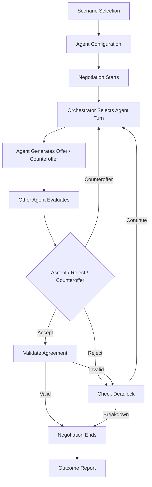
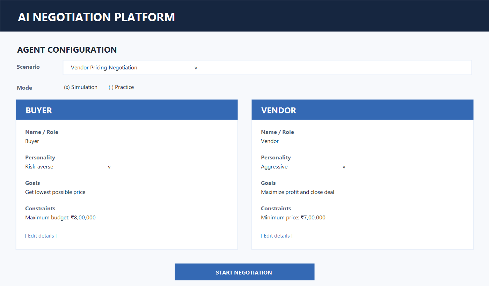

# AI-Driven Multi-Agent Negotiation Training & Simulation Platform

## 1. Project Overview

This project is an AI-driven multi-agent negotiation platform where multiple LLM-powered agents represent different stakeholders. Each agent has its own role, goals, constraints, and negotiation personality.

The platform supports two modes:

- **Simulation Mode:** AI agents negotiate with each other while the user observes the transcript, offers, concessions, and metrics.
- **Practice Mode:** A human participates as one negotiating party against AI agents and receives feedback on the negotiation outcome.

An **Orchestrator Agent** manages turn-taking, passes the current state and history to the active party, tracks rounds and concessions, detects deadlocks, and starts outcome reporting.

## 2. System Workflow

For the detailed round-by-round sequence, orchestrator state machine, deadlock handling, and mode flow, see [docs/system-workflow.md](docs/system-workflow.md).

## 3. Agent Personas

The initial demonstration uses two parties:

- **Buyer:** Company Purchasing Manager; seeks the lowest possible price; maximum budget ₹8,00,000; risk-averse.
- **Vendor:** Vendor/Sales Representative; seeks maximum profit and a closed deal; minimum acceptable price ₹7,00,000; aggressive.

See [docs/agent-personas.md](docs/agent-personas.md) for full persona behavior, decision rules, and personality profiles.

## 4. Selected Negotiation Scenario

The first scenario is **Vendor Pricing Negotiation**. The Buyer negotiates to purchase products within budget, while the Vendor protects its minimum acceptable price and attempts to maximize profit.

See [docs/negotiation-scenario.md](docs/negotiation-scenario.md) for objectives, constraints, terms, an example exchange, agreement validation, and the three-scenario catalogue.

## 5. Basic Agent Configuration UI Wireframe

The configuration screen provides scenario selection, mode selection, agent names and roles, personality selectors, goals, constraints, validation, and a Start Negotiation action.

See [docs/ui-wireframe.md](docs/ui-wireframe.md) for the annotated wireframe, control descriptions, validation rules, and transition into the Negotiation Arena.

