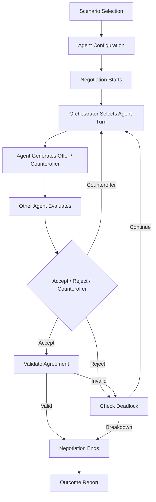

# NegoSim — Multi-Agent Negotiation Training & Simulation Platform

## 1. Project Overview

This project is an AI-driven multi-agent negotiation platform where multiple LLM-powered agents represent different stakeholders. Each agent has its own role, goals, constraints, and negotiation personality.

The platform supports two modes:

- **Simulation Mode:** AI agents negotiate with each other while the user observes the transcript, offers, concessions, and metrics.
- **Practice Mode:** A human participates as one negotiating party against AI agents and receives feedback on the negotiation outcome.

An **Orchestrator Agent** manages turn-taking, passes the current state and history to the active party, tracks rounds and concessions, detects deadlocks, and starts outcome reporting.

## 2. System Workflow



For the detailed round-by-round sequence, orchestrator state machine, deadlock handling, and mode flow, see [docs/system-workflow.md](docs/system-workflow.md).

## 3. Agent Personas

The initial demonstration uses two parties:

- **Buyer:** Company Purchasing Manager; seeks the lowest possible price; maximum budget ₹8,00,000; risk-averse.
- **Vendor:** Vendor/Sales Representative; seeks maximum profit and a closed deal; minimum acceptable price ₹7,00,000; aggressive.

See [docs/agent-personas.md](docs/agent-personas.md) for full persona behavior, decision rules, and personality profiles.

## 4. Selected Negotiation Scenario

The first scenario is **Vendor Pricing Negotiation**. The Buyer negotiates to purchase products within budget, while the Vendor protects its minimum acceptable price and attempts to maximize profit.

See [docs/negotiation-scenario.md](docs/negotiation-scenario.md) for objectives, constraints, terms, an example exchange, agreement validation, and the three-scenario catalogue.

---

## Milestone 1 Scope
Milestone 1 implements the complete **pre-negotiation setup workflow**:

1. **Scenario Selection Module** — a polished, card-based screen for choosing one of three predefined negotiation scenarios (Vendor Pricing, Job Offer, Project Budget Allocation), each with a 3D hover/tilt effect and clear selected state.
2. **Scenario Data** — all scenario and agent definitions (name, role, goal, constraint) live in a single centralized data module (`js/data/scenarios.js`), decoupled from UI logic so it can later be swapped for a backend/API call.
3. **Agent Configuration** — agent cards are generated dynamically from the selected scenario's data (never hardcoded per scenario), showing each agent's goal and constraint.
4. **Personality Selection** — each agent gets an independent personality selector (Aggressive / Collaborative / Risk-Averse), stored per-agent in centralized application state.
5. **Basic Workflow** — a 4-step flow: `Scenario Selection → Agent Configuration → Goals & Constraints Summary → Ready to Start Negotiation`, with forward/back navigation and a step indicator in the header.
6. **Validation** — the user cannot continue without selecting a scenario, and cannot proceed past agent configuration until every agent has a personality assigned; clear inline warning banners explain what's missing.

No LLM integration, offer generation, real-time negotiation, or backend/auth is implemented in this milestone — the final screen only indicates the app is "Ready to Start Negotiation" as a placeholder for the next phase.

## Technologies Used
- HTML5
- CSS3 (custom properties/design tokens, CSS Grid, 3D transforms for card tilt/depth effects)
- Clean, modern, "AI-humanized" white-color UI theme
- Vanilla JavaScript (no frameworks, no build step)

## Project Structure
```
project/
├── index.html
├── css/
│   └── style.css
├── js/
│   ├── data/
│   │   └── scenarios.js   # centralized scenario + personality data
│   ├── state/
│   │   └── appState.js    # centralized app state (selected scenario, personalities, step)
│   └── app.js              # rendering + navigation + interaction logic
└── README.md
```

## How to Run
No build step or dependencies are required.

1. Open a terminal in the `project/` folder.
2. Start any static file server, for example:
   ```bash
   python3 -m http.server 8000
   ```
3. Open `http://localhost:8000` in your browser.

(Opening `index.html` directly via `file://` also works, since the app uses only plain `<script>` tags.)

## Application State
A single `AppState` module (`js/state/appState.js`) tracks:
- `currentStep` — which of the 4 workflow steps is active
- `selectedScenarioId` — the chosen scenario
- `personalities` — a map of `agentId → personalityId`

All UI re-renders reactively whenever state changes, via a simple subscribe/notify pattern.

## 6. Orchestrator Agent & Negotiation Engine (Milestone 2 — Full)

This milestone delivers the complete foundational Python backend for NegoSim: a modular negotiation engine powered by **Google Gemini 3.5 Flash**, with deterministic concession logic and full end-to-end multi-round simulation across all three scenario templates.

### What was built

| File | Purpose |
|------|---------|
| `negotiation_state.py` | `NegotiationState` data model — tracks rounds, turn order, full history, offers, decisions. JSON-serializable. |
| `orchestrator.py` | Turn-taking loop with correct round counting, state recording, and end-condition detection. |
| `agent_input.py` | `AgentProfile` + `AgentInputPayload` — structured prompt payload sent to the LLM. |
| `concession_engine.py` | Personality-based concession math (Aggressive/Collaborative/Risk-Averse). Deterministic and testable without API. |
| `llm_interface.py` | `generate_agent_response()` — calls Gemini 3.5 Flash with structured JSON output. Safe fallback on parse errors. |
| `agents.py` | `Agent` class — wraps profile, concession engine, and LLM interface into a single `take_turn()` call. |
| `scenarios/vendor_pricing.py` | Buyer vs Vendor scenario |
| `scenarios/job_offer.py` | Candidate vs Hiring Manager scenario |
| `scenarios/budget_allocation.py` | Project Manager vs Finance Director scenario |

### How to Run

```bash
# Install dependencies (once)
pip install -r orchestrator/requirements.txt

# Add your Gemini API key to orchestrator/.env
echo "GEMINI_API_KEY=your_key_here" > orchestrator/.env

# Run all 3 scenarios with real Gemini AI
python orchestrator/run_all_scenarios_demo.py

# Run in mock mode (no API key needed — deterministic rule-based responses)
python orchestrator/run_all_scenarios_demo.py --mock

# Single scenario quick-test
python orchestrator/run_vendor_pricing_demo.py --mock
```

See [`orchestrator/README.md`](orchestrator/README.md) for full architecture documentation.

## Known Limitations
- The negotiation transcript is not yet visualized round-by-round on the UI.
- Practice Mode (human vs AI) is not yet wired to a UI screen.

## Planned for Future Phases
- Real-time round-by-round display in the frontend via WebSockets or polling.
- Practice Mode UI allowing the human player to submit text offers.
- Evaluation scoring: coaching feedback on human negotiation performance.

