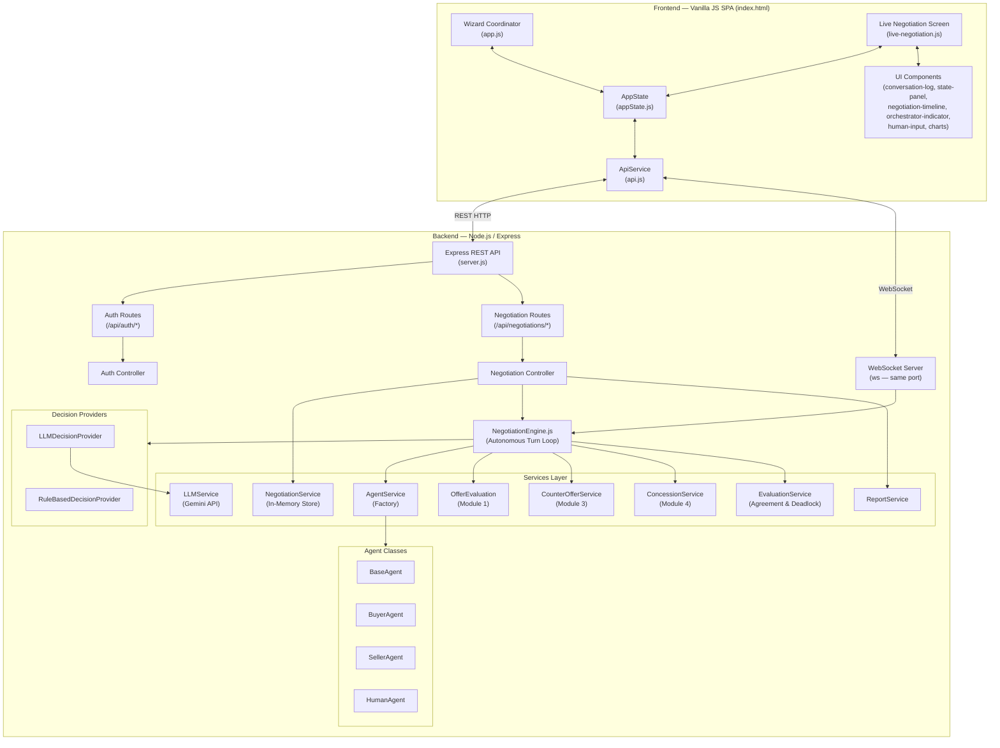
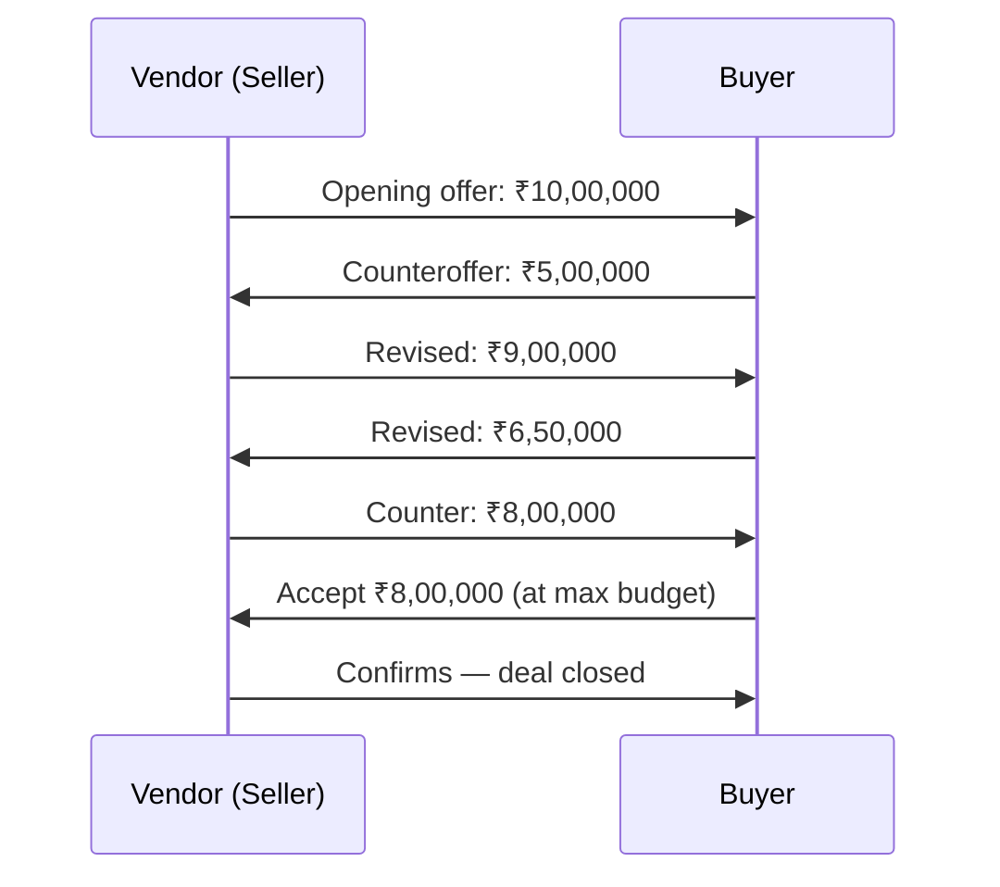

# NegoSim — AI-Driven Multi-Agent Negotiation Training & Simulation Platform

**An academic and enterprise-grade multi-agent negotiation simulation and training platform featuring a Node.js/Express backend, dual-mode reasoning engine (Google Gemini LLM / Deterministic Rule Engine), Role-Aware Concession Telemetry, real-time WebSocket orchestration, and a Vanilla JS SPA frontend.**

🔗 **GitHub Repository:** [https://github.com/adarshmichael/ai-multi-agent-negotiation](https://github.com/adarshmichael/ai-multi-agent-negotiation)  
🚀 **Live Backend API:** [https://negosim-backend.onrender.com](https://negosim-backend.onrender.com)

---

## 📋 Table of Contents

- [Executive Overview](#-executive-overview)
- [Project Objectives](#-project-objectives)
- [Project Milestones](#-project-milestones)
- [Key Features](#-key-features)
- [Modes of Operation](#️-modes-of-operation)
- [System Architecture](#-system-architecture)
- [Decision & Concession Engine Architecture](#-decision--concession-engine-architecture)
- [Negotiation Scenarios](#-negotiation-scenarios)
- [Agent Personas & Personality Profiles](#-agent-personas--personality-profiles)
- [Technology Stack](#-technology-stack)
- [Project Structure](#-project-structure)
- [Backend REST API Endpoints](#-backend-rest-api-endpoints)
- [WebSocket Events](#-websocket-events)
- [Environment Configuration](#-environment-configuration)
- [Feature Verification Matrix](#-feature-verification-matrix)
- [Local Development Setup](#-local-development-setup)
- [Automated Test Suite](#-automated-test-suite)
- [Agile Documentation](#-agile-documentation)
- [Known Limitations & Future Scope](#-known-limitations--future-scope)
- [License](#-license)

---

## 📋 Executive Overview

**NegoSim** simulates dynamic, multi-round negotiations between autonomous AI agents, or between a human user and AI agents. It evaluates structured offers against hard numeric constraints, tracks concession dynamics across every round, detects negotiation deadlocks, and generates analytical outcome reports — all delivered in real-time via WebSockets.

- **Problem**: Negotiating effectively requires deliberate practice, but coordinating roleplay with domain experts is costly and logistically difficult.
- **Solution**: A full-stack platform where LLM-powered agents (driven by Google Gemini) represent stakeholders with explicit roles, numeric hard constraints, configurable goals, and distinct negotiation personalities. Both fully autonomous simulations and interactive human-vs-AI practice sessions are supported.
- **Key Capabilities**:
  - **Simulation Mode**: Two AI agents negotiate autonomously until agreement, deadlock, or max rounds.
  - **Practice Mode**: A human participant takes the role of one agent in a live, turn-by-turn session against the AI.
  - **LLM Mode**: Decisions are generated by Google Gemini using full context-aware prompts.
  - **Rule-Based (Mock) Mode**: A deterministic personality-parameterized engine generates decisions instantly without any API calls — fully functional offline.
- **Target Users**: Students learning negotiation theory, professionals training for high-stakes deals, and researchers studying AI-driven game theory.
- **Key Technologies**: Vanilla JS/CSS3 (Frontend), Node.js/Express (Backend), WebSocket (`ws`) for real-time events, `@google/generative-ai` for LLM reasoning, MongoDB/Mongoose for user authentication and persistence.

---

## 🎯 Project Objectives

1. Provide a realistic, low-stakes environment for humans to practice negotiation against contextually intelligent AI agents.
2. Demonstrate autonomous AI-to-AI negotiation with personality-driven concession strategies and hard constraint enforcement.
3. Build a robust 5-module decision engine pipeline: **Offer Evaluation → Agent Decision → Counteroffer Generation → Concession Tracking → LLM Prompt Integration**.
4. Ensure strict adherence to numeric hard constraints (e.g., maximum budget, minimum acceptable price) at both the LLM prompt layer and the backend guardrail layer.
5. Deliver fully real-time UI updates using WebSockets without the overhead of a heavy frontend framework or build system.
6. Produce structured, exportable negotiation outcome reports with per-agent satisfaction scores, concession timelines, and key insights.
7. Provide a graceful multi-level fallback chain: **LLM (Gemini) → Mock Generator → Rule-Based Engine** to guarantee the negotiation always progresses.

---

## 🎯 Project Milestones

### Milestone 1 — Pre-Negotiation Setup & Scenario Wizard ✅ COMPLETE

**Purpose**: Establish the end-to-end frontend wizard for scenario selection, agent configuration, and validation before any negotiation starts.

**Implementation**:
- A polished, card-based scenario selection screen with CSS 3D tilt/depth effects for all three predefined scenarios.
- Agent configuration step where each agent's goals and constraints are loaded dynamically from the centralized `js/data/scenarios.js` data module — nothing is hardcoded per scenario.
- Independent personality selector per agent (`Aggressive`, `Collaborative`, `Risk-Averse`) stored in centralized `AppState`.
- A 4-step validation wizard: `Scenario Selection → Agent Configuration → Goals & Constraints Summary → Ready to Start`, with forward/back navigation, a step indicator, and inline validation banners.

**Key Files**: [`js/data/scenarios.js`](js/data/scenarios.js), [`js/state/appState.js`](js/state/appState.js), [`js/app.js`](js/app.js), [`index.html`](index.html)

---

### Milestone 2 — LLM Reasoning Engine & Backend API ✅ COMPLETE

**Purpose**: Integrate a production-grade LLM reasoning engine via Google Gemini and build the complete Express/WebSocket backend.

**Implementation**:
- `LLMDecisionProvider` constructs detailed context-aware prompts via `promptBuilder.js` including agent persona, personality rules, numeric constraints, last 8 turns of history, and structured Module 1–4 context (offer evaluation, counteroffer parameters, concession state).
- Multi-model fallback chain: `gemini-2.0-flash` → `gemini-2.0-flash-lite` → `gemini-1.5-flash` → `gemini-1.5-flash-8b`.
- Multi-key rotation: supports comma-separated `GEMINI_API_KEYS` for load balancing across rate limits.
- `RuleBasedDecisionProvider` provides a personality-parameterized deterministic fallback (fully functional without an API key).
- Backend constraint guardrails: `BaseAgent.validateResponse()` clamps any LLM-generated offer that violates a numeric hard constraint before it is ever broadcast.

**Key Files**: [`backend/engine/decisionProvider.js`](backend/engine/decisionProvider.js), [`backend/services/llm.service.js`](backend/services/llm.service.js), [`backend/utils/promptBuilder.js`](backend/utils/promptBuilder.js), [`backend/agents/BaseAgent.js`](backend/agents/BaseAgent.js)

---

### Milestone 3 — Live Negotiation Arena & Practice Mode ✅ COMPLETE

**Purpose**: Deliver the real-time negotiation UI and human-in-the-loop practice mode.

**Implementation**:
- A live negotiation arena (`index.html` + `js/screens/live-negotiation.js`) with a 3-column grid layout: Agent Profile Cards (left), Live Chat Stream (center), AI Reasoning & State Panel (right).
- WebSocket-driven UI updates: each `agent_message`, `offer_updated`, `round_started`, and `agent_thinking` event updates a specific DOM component instantly.
- **Practice Mode**: The engine pauses on the human agent's turn, broadcasts `human_turn_required`, and the frontend mounts `HumanInput` panel. The human submits via WebSocket `human_input` event; the engine resumes.
- Enhanced deadlock detection with non-terminating `deadlock_warning` banner before a hard deadlock terminates the session.
- Concession Tracker component (`charts.js`) providing per-agent visual progress bars.
- Orchestrator Pipeline Indicator (`orchestrator-indicator.js`) visualizing the 12-step processing pipeline.

**Key Files**: [`backend/engine/NegotiationEngine.js`](backend/engine/NegotiationEngine.js), [`backend/agents/HumanAgent.js`](backend/agents/HumanAgent.js), [`js/components/human-input.js`](js/components/human-input.js), [`js/screens/live-negotiation.js`](js/screens/live-negotiation.js)

---

### Milestone 4 — Outcome Reporting, Analytics & Authentication ✅ COMPLETE

**Purpose**: Deliver negotiation outcome analysis, structured report export, and user authentication infrastructure.

**Implementation**:
- `report.service.js` generates structured reports from completed sessions including per-agent satisfaction scores (0–100), concession timeline (round-by-round), decision breakdown (accept/counter/reject counts), and key textual insights.
- Transcript export via `transcript.service.js` supporting both `.txt` (human-readable) and `.json` (structured) formats via `GET /api/negotiations/:id/transcript`.
- User authentication system: `POST /api/auth/register`, `POST /api/auth/login`, `POST /api/auth/google` (Google OAuth via ID token decoding), and `GET /api/auth/me` (JWT-protected profile endpoint).
- Mongoose `User` model with bcrypt password hashing (12 rounds), unique email constraint, and Google OAuth linking.

**Key Files**: [`backend/services/report.service.js`](backend/services/report.service.js), [`backend/services/transcript.service.js`](backend/services/transcript.service.js), [`backend/controllers/auth.controller.js`](backend/controllers/auth.controller.js), [`backend/models/user.model.js`](backend/models/user.model.js)

---

## ✨ Key Features

### 1. Five-Module Decision Engine Pipeline

The backend implements a sequential five-module decision pipeline per agent turn:

| Module | Service | Purpose |
|---|---|---|
| **M1: Offer Evaluation** | `offerEvaluation.service.js` | Deterministically evaluates the opponent's offer — `FAVORABLE`, `PARTIALLY_ACCEPTABLE`, or `UNACCEPTABLE` — relative to the agent's target, constraints, and round urgency. |
| **M2: Decision Selection** | `decisionProvider.js` | Selects `ACCEPT`, `COUNTER`, or `REJECT` using either Gemini LLM or the rule-based engine, with constraint enforcement as a final override layer. |
| **M3: Counteroffer Generation** | `counteroffer.service.js` | Generates a deterministic, personality-aware counteroffer using a Boulware-style target-anchored concession strategy, rounded to the nearest ₹500. |
| **M4: Concession Tracking** | `concession.service.js` | Records every offer movement, validates against safeguard rules (`REVERSAL`, `EXCESSIVE`, `STAGNATION`, `LIMIT_BREACH`), and computes full concession snapshots. |
| **M5: LLM Prompt Integration** | `promptBuilder.js` | Embeds the M1–M4 structured context (evaluation result, deterministic decision, counteroffer parameters, concession state) directly into the Gemini prompt so LLM output is consistent with deterministic logic. |

### 2. Personality-Parameterized Negotiation

Seven distinct negotiation personalities are configured in `backend/config/personalityParams.js`, each with unique initial offer factors, concession rates, acceptance thresholds, and per-round movement caps:

| Personality | Initial Anchor | Concession Rate | Max Move/Round |
|---|---|---|---|
| Aggressive | 58%/142% of limit | 6% | 8% |
| Competitive | 60%/140% | 7% | 8% |
| Risk-Averse | 67%/133% | 10% | 12% |
| Analytical | 65%/135% | 9% | 10% |
| Professional | 68%/132% | 11% | 12% |
| Collaborative | 72%/128% | 14% | 18% |
| Flexible | 70%/130% | 16% | 22% |

### 3. Real-Time WebSocket Arena

- A `WebSocketServer` (`ws`) shares the same HTTP port via `server.on('upgrade', ...)`.
- The `NegotiationEngine` broadcasts per-event payloads after every action.
- Clients reconnect-safe: on reconnection, `connection_established` sends the full current session state.
- Multiple concurrent WebSocket clients per session are supported via a `Set`-based registry.

### 4. Agreement & Deadlock Intelligence

- **Auto-Agreement**: Offers within 1% tolerance of each other trigger automatic deal closure without requiring an explicit `accept` decision.
- **Deadlock Warning** (non-terminating): Emitted as an in-chat banner when all agents have been stagnant for N-1 rounds.
- **Hard Deadlock**: Terminates with `REJECTION` result when all agents have been stagnant for N consecutive rounds (default: 4).
- **Single-agent stagnation** only triggers a warning — it never terminates the session, preventing premature endings from slow-conceding aggressive personalities.

### 5. Structured Outcome Reporting

`report.service.js` produces a full report object including:
- **Satisfaction Scores** (0–100): Constraint-aware scoring for each agent based on the final agreed price relative to their target and hard limit.
- **Concession Timeline**: Round-by-round entry grouped by round number with action type and formatted offer amounts.
- **Decision Breakdown**: Per-agent count of `accept`, `counter_offer`, and `reject` decisions.
- **Key Insights**: Automatically generated textual insights (largest conceder, efficiency, constraint respect, satisfaction summary).

---

## 🎛️ Modes of Operation

NegoSim operates across two independent dimensions:

```
Participant Dimension:  Simulation Mode (AI ↔ AI)  |  Practice Mode (Human ↔ AI)
Engine Dimension:       Gemini LLM Mode             |  Rule-Based (Mock) Mode
```

| Mode | Description |
|---|---|
| **Simulation (AI vs AI)** | Both parties controlled by the autonomous engine. Runs to completion without human intervention. |
| **Practice (Human vs AI)** | Human takes the first agent role. The engine pauses on human turns, emits `human_turn_required`, and awaits WebSocket `human_input`. |
| **Gemini LLM Mode** | Contextual decisions by Google Gemini. Requires `GEMINI_API_KEY`. Falls back to Mock if keys are unavailable. |
| **Rule-Based Mode** | Fully deterministic, personality-parameterized decisions. No API key required. Runs instantly. |

---

## 🏗️ System Architecture


```mermaid
flowchart TD
    subgraph Frontend["Frontend — Vanilla JS SPA (index.html)"]
        AppState["AppState\n(appState.js)"]
        App["Wizard Coordinator\n(app.js)"]
        Arena["Live Negotiation Screen\n(live-negotiation.js)"]
        ApiSvc["ApiService\n(api.js)"]
        Components["UI Components\n(conversation-log, state-panel,\nnegotiation-timeline, orchestrator-indicator,\nhuman-input, charts)"]

        App <--> AppState
        Arena <--> AppState
        Arena <--> Components
        AppState <--> ApiSvc
    end

    subgraph Backend["Backend — Node.js / Express"]
        HTTP["Express REST API\n(server.js)"]
        WS["WebSocket Server\n(ws — same port)"]
        AuthRoutes["Auth Routes\n(/api/auth/*)"]
        NegRoutes["Negotiation Routes\n(/api/negotiations/*)"]
        AuthCtrl["Auth Controller"]
        NegCtrl["Negotiation Controller"]
        Engine["NegotiationEngine.js\n(Autonomous Turn Loop)"]

        subgraph Services["Services Layer"]
            NegSvc["NegotiationService\n(In-Memory Store)"]
            AgentSvc["AgentService\n(Factory)"]
            LLMSvc["LLMService\n(Gemini API)"]
            EvalSvc["OfferEvaluation\n(Module 1)"]
            COSvc["CounterOfferService\n(Module 3)"]
            ConSvc["ConcessionService\n(Module 4)"]
            DeadlockSvc["EvaluationService\n(Agreement & Deadlock)"]
            ReportSvc["ReportService"]
        end

        subgraph Agents["Agent Classes"]
            Base["BaseAgent"]
            Buyer["BuyerAgent"]
            Seller["SellerAgent"]
            Human["HumanAgent"]
        end

        subgraph Decision["Decision Providers"]
            Rule["RuleBasedDecisionProvider"]
            LLM["LLMDecisionProvider"]
        end

        HTTP --> AuthRoutes --> AuthCtrl
        HTTP --> NegRoutes --> NegCtrl --> NegSvc
        NegCtrl --> Engine
        WS --> Engine
        Engine --> AgentSvc --> Agents
        Engine --> Decision
        LLM --> LLMSvc
        Engine --> EvalSvc
        Engine --> COSvc
        Engine --> ConSvc
        Engine --> DeadlockSvc
        NegCtrl --> ReportSvc
    end

    ApiSvc <-->|"REST HTTP"| HTTP
    ApiSvc <-->|"WebSocket"| WS
```

### Data Flow

1. **Setup (UI)**: User selects scenario, configures agent goals/constraints/personalities in the wizard → stored in `AppState`.
2. **Session Creation**: `ApiService.createNegotiation()` → `POST /api/negotiations` → `negotiation.controller` validates payload → `negotiation.service` creates in-memory session → returns `negotiationId`.
3. **Connect & Start**: Frontend opens WebSocket (`ws://host?negotiationId=...`) → calls `POST /api/negotiations/:id/start` → engine begins autonomous loop.
4. **Turn Execution (per round)**:
   - Engine detects agent type (`human` vs AI).
   - **AI Turn**: M1 evaluates opponent offer → M2 selects decision via LLM or rule engine → M3 generates counteroffer → M4 validates and records concession → M5 prompt is enriched with M1–M4 context for LLM calls.
   - **Human Turn**: Engine broadcasts `human_turn_required` → frontend mounts `HumanInput` panel → human submits via WS → engine resumes.
5. **Broadcast**: Engine broadcasts `agent_message`, `offer_updated`, `round_started`, `agent_thinking`, `deadlock_warning` events over WebSocket.
6. **UI Update**: `ApiService` receives events → dispatches to `LiveNegotiationScreen` → updates `ConversationLog`, `StatePanel`, `NegotiationTimeline`, `OrchestratorIndicator`, agent cards.
7. **Completion**: Agreement or termination condition detected → engine broadcasts `negotiation_completed` with full summary and concession data → UI renders terminal result card.

---

## ⚙️ Decision & Concession Engine Architecture

### Role-Aware Concession Metrics

The `concession.service.js` (Module 4) tracks and validates every offer movement:

| Metric | Formula / Description |
|---|---|
| **Step Concession Amount** | `\|current_offer - previous_offer\|` |
| **Step Concession %** | `(concession_amount / \|previous_offer\|) × 100` |
| **Total Concession** | Sum of all step concession amounts from initial position |
| **Remaining Flexibility** | Distance from current offer to agent's hard constraint limit |
| **Flexibility Consumed %** | `(1 - remaining_flexibility / initial_flexibility) × 100` |
| **ZOPA** | `max_buyer_limit - min_seller_limit` (computed per scenario) |

### Concession Safeguard Flags

`validateConcession()` enforces four safeguard rules before any offer is finalized:

| Flag | Trigger | Effect |
|---|---|---|
| `LIMIT_BREACH` | Proposed offer violates hard constraint | Clamped to limit |
| `REVERSAL` | Agent moves in wrong direction (e.g. buyer going lower, seller going higher) | Position frozen at previous offer (±₹500 tolerance) |
| `EXCESSIVE` | Single-round move exceeds personality's `maxSingleRoundPct` | Offer capped to personality limit |
| `STAGNATION` | Less than ₹500 movement in last 3 consecutive rounds | Warning flag raised |

### Counteroffer Strategy (Module 3)

Boulware-style target-anchored gradual concession:

```
Buyer  (moves UP):  raw = myLastOffer + (opponentOffer - myLastOffer) × effectiveRate
Seller (moves DOWN): raw = myLastOffer - (myLastOffer - opponentOffer) × effectiveRate

effectiveRate = concessionRate × (1 + urgencyFactor × 2.5)
urgencyFactor = currentRound / maxRounds  (increases pressure near end)
```

All offers are rounded to the nearest ₹500 and clamped to hard constraint limits.

---

## 📊 Negotiation Scenarios

Three fully configurable scenarios are built into the platform. Each agent supports user-overridable goals, constraint selections, and numeric boundaries.

| Scenario | Role 1 (Buyer/Minimizer) | Role 2 (Seller/Maximizer) | Default ZOPA |
|---|---|---|---|
| **Vendor Pricing Negotiation** | Buyer — Max Budget: ₹8,00,000 | Vendor — Min Price: ₹7,00,000 | ₹1,00,000 |
| **Job Offer Negotiation** | Candidate — Min CTC: ₹12,00,000 | Employer — Max CTC: ₹18,00,000 | ₹6,00,000 |
| **Project Budget Allocation** | Project Manager — Min Budget: ₹20,00,000 | Finance Manager — Max Budget: ₹30,00,000 | ₹10,00,000 |

### Vendor Pricing Negotiation — Example Exchange


```mermaid
sequenceDiagram
    participant V as Vendor (Seller)
    participant B as Buyer

    V->>B: Opening offer: ₹10,00,000
    B->>V: Counteroffer: ₹5,00,000
    V->>B: Revised: ₹9,00,000
    B->>V: Revised: ₹6,50,000
    V->>B: Counter: ₹8,00,000
    B->>V: Accept ₹8,00,000 (at max budget)
    V->>B: Confirms — deal closed
```

**Agreement Validation Criteria:**
- Final price is between ₹7,00,000 (vendor floor) and ₹8,00,000 (buyer ceiling).
- **Auto-close**: If both offers are within 1% of each other, the engine closes automatically.

---

## 🧑‍💼 Agent Personas & Personality Profiles

### Default Personas (Vendor Pricing Scenario)

| Property | Buyer | Vendor |
|---|---|---|
| **Role** | Company Purchasing Manager | Sales Representative |
| **Goal** | Lowest possible price within budget | Maximum profit, close the deal |
| **Hard Constraint** | Maximum: ₹8,00,000 | Minimum: ₹7,00,000 |
| **Default Personality** | Risk-Averse | Aggressive |
| **Decision Rule** | Accept only at or below ₹8,00,000 | Accept only at or above ₹7,00,000 |

### Personality Behavior Reference

| Personality | Behavior Style | Concession Pattern | Accept Threshold |
|---|---|---|---|
| **Aggressive** | Strong anchors, direct, firm | Very slow, conditional | Last 20% of rounds |
| **Competitive** | Max-advantage focus, uses leverage | Slow, strategic | Last 25% of rounds |
| **Risk-Averse** | Requests evidence, avoids risk | Small, carefully measured | Last 40% of rounds |
| **Analytical** | Data-grounded, benchmarks every move | Moderate, logical | Last 35% of rounds |
| **Professional** | Formal, policy-referenced | Structured, documented | Last 40% of rounds |
| **Collaborative** | Seeks shared value, transparent | Moderate, trade-oriented | Past halfway (50%) |
| **Flexible** | Adapts, creative trade-offs | Larger, goodwill-driven | From 40% onwards |

---

## 🛠️ Technology Stack

| Layer | Technology | Version | Purpose |
|---|---|---|---|
| **Frontend** | Vanilla HTML5, CSS3, JavaScript (ES6+) | — | SPA shell with zero build step |
| **CSS Architecture** | Custom design system (9 modular stylesheets) | — | Glassmorphism, CSS Grid, 3D transforms, CSS variables |
| **Backend Framework** | Node.js + Express | `>=18.0.0`, `4.19.2` | REST API + static file serving |
| **Real-Time** | WebSocket (`ws`) | `8.18.0` | Live turn-by-turn event streaming |
| **AI / LLM** | Google Generative AI (`@google/generative-ai`) | `^0.21.0` | Gemini multi-model LLM reasoning |
| **Database / Auth** | MongoDB + Mongoose + bcryptjs + jsonwebtoken | `^9.10.2`, `^3.0.3`, `^9.0.3` | User accounts, JWT auth, Google OAuth |
| **Utilities** | uuid, dotenv, cors | `^10.0.0`, `^16.4.5`, `^2.8.5` | ID generation, env config, CORS |
| **Testing** | Node.js built-in `assert` module (custom runner) | — | Service-level unit tests |
| **Deployment** | Render (backend) | — | Production cloud hosting |

---

## 📁 Project Structure

```
NegoSim/
├── README.md                          ← Project Root Master Overview
├── AGENT_CONTEXT.md                   ← AI agent working context & architecture guide
├── CSS_MAP.md                         ← CSS architecture quick-reference for agents
├── LICENSE
├── index.html                         ← SPA shell: wizard screens + negotiation arena
├── app.html                           ← Alternative app entry (standalone)
│
├── css/                               ← Modular CSS design system (9 files)
│   ├── style.css                      ← Entry point — imports all 9 stylesheets
│   ├── base.css                       ← Design tokens, CSS variables, reset, typography
│   ├── layout.css                     ← App shell, header, arena 3-column grid
│   ├── components.css                 ← Stepper, cards, buttons, banners
│   ├── agents.css                     ← Agent cards, personality tabs, Concession Tracker
│   ├── negotiation.css                ← Chat stream, message bubbles, offer evaluation badges
│   ├── orchestrator.css               ← Orchestrator pipeline, control bar, pulse indicators
│   ├── reasoning.css                  ← State grid, AI reasoning card, evaluation chips
│   ├── completion.css                 ← Terminal result card (agreement / rejection)
│   └── responsive.css                 ← Tablet & mobile breakpoints
│
├── js/                                ← Client-side JavaScript (modular, no build)
│   ├── app.js                         ← Main wizard coordinator (38,000+ LOC)
│   ├── data/
│   │   ├── scenarios.js               ← Centralized scenario + agent catalog (frontend)
│   │   └── api.js                     ← HTTP + WebSocket client (ApiService)
│   ├── state/
│   │   └── appState.js                ← Reactive state store (subscribe/notify)
│   ├── screens/
│   │   └── live-negotiation.js        ← Live arena screen coordinator
│   └── components/
│       ├── conversation-log.js        ← Chat bubble renderer
│       ├── negotiation-timeline.js    ← Round-by-round progress bar
│       ├── orchestrator-indicator.js  ← 12-step pipeline visual indicator
│       ├── state-panel.js             ← Round/offer/decision state card
│       ├── human-input.js             ← Practice Mode input panel [M3]
│       └── charts.js                  ← Concession tracker charts [M4]
│
├── assets/
│   └── agent-configuration-wireframe.png
│
├── docs/                              ← System documentation
│   ├── system-workflow.md             ← End-to-end workflow & sequence diagrams
│   ├── agent-personas.md              ← Agent persona behavior & decision model
│   ├── negotiation-scenario.md        ← Scenario definitions & agreement validation
│   └── ui-wireframe.md                ← UI wireframe specifications
│
├── Agile-Documentation/               ← Project management & sprint tracking
│   ├── NegoSim_Team1_Agile_Tracker.xlsx
│   └── Team-1_Agile_Document.xlsx
│
└── backend/                           ← Node.js backend
    ├── server.js                      ← Entry point: Express + WebSocket server
    ├── package.json                   ← Dependencies & npm scripts
    ├── .env.example                   ← Environment variable template
    │
    ├── config/
    │   ├── env.js                     ← Environment loader & validator
    │   └── personalityParams.js       ← Shared personality parameters (7 profiles)
    │
    ├── agents/                        ← OOP agent class hierarchy
    │   ├── BaseAgent.js               ← Abstract base: prompt building + constraint enforcement
    │   ├── BuyerAgent.js              ← Buyer persona subclass
    │   ├── SellerAgent.js             ← Seller persona subclass
    │   ├── HumanAgent.js              ← Human participant (no LLM, pause/resume) [M3]
    │   └── CustomAgent.js             ← Generic custom agent
    │
    ├── engine/
    │   ├── NegotiationEngine.js       ← Autonomous turn orchestrator (618 lines)
    │   └── decisionProvider.js        ← Decision abstraction: RuleBased + LLM providers
    │
    ├── controllers/
    │   ├── negotiation.controller.js  ← HTTP handlers for all negotiation endpoints
    │   └── auth.controller.js         ← Register, login, Google OAuth, getMe
    │
    ├── routes/
    │   ├── negotiation.routes.js      ← All /api/negotiations/* routes
    │   ├── auth.routes.js             ← All /api/auth/* routes
    │   └── health.routes.js           ← GET /api/health
    │
    ├── middleware/
    │   ├── auth.js                    ← JWT protect middleware + token generator
    │   └── errorHandler.js            ← Global Express error handler
    │
    ├── models/
    │   ├── negotiation.model.js       ← Session state factory + STATUS/RESULT constants
    │   ├── agent.model.js             ← Agent config factory
    │   ├── message.model.js           ← Chat message factory
    │   ├── offer.model.js             ← Offer action factory + ACTION constants
    │   └── user.model.js              ← Mongoose User schema (bcrypt, Google OAuth)
    │
    ├── services/
    │   ├── negotiation.service.js     ← In-memory session store + scenario definitions
    │   ├── agent.service.js           ← Agent factory (instantiates correct class)
    │   ├── llm.service.js             ← Google Gemini API client + Mock generator
    │   ├── offerEvaluation.service.js ← Module 1: Deterministic offer evaluation
    │   ├── counteroffer.service.js    ← Module 3: Boulware counteroffer generation
    │   ├── concession.service.js      ← Module 4: Concession tracking & safeguards
    │   ├── evaluation.service.js      ← Agreement detection & deadlock checking
    │   ├── report.service.js          ← Outcome report builder (satisfaction + insights)
    │   └── transcript.service.js      ← TXT/JSON transcript export
    │
    ├── utils/
    │   ├── promptBuilder.js           ← Context-aware LLM prompt constructor (M5)
    │   ├── logger.js                  ← Structured console logger
    │   └── idGenerator.js             ← UUID-based session ID generator
    │
    └── tests/                         ← Service-level test suites
        ├── concessionTracking.test.js ← Module 4: 5-round tracking scenarios
        ├── counteroffer.test.js       ← Module 3: Counteroffer generation
        ├── offerEvaluation.test.js    ← Module 1: Offer evaluation outcomes
        └── integrationEngine.test.js  ← End-to-end engine integration test
```

---

## 📡 Backend REST API Endpoints

| Method | Endpoint | Purpose |
|---|---|---|
| `GET` | `/api/health` | Backend status, version, Gemini config flag |
| `POST` | `/api/auth/register` | Register new user — `{ name, email, password }` |
| `POST` | `/api/auth/login` | Login — `{ email, password }` → JWT token |
| `POST` | `/api/auth/google` | Google OAuth via ID token — `{ credential }` |
| `GET` | `/api/auth/me` | Get authenticated user profile (JWT required) |
| `GET` | `/api/scenarios` | List all 3 predefined negotiation scenarios |
| `POST` | `/api/negotiations` | Create session — `{ scenario_id, agents, maximum_rounds?, mode?, practice_mode? }` |
| `GET` | `/api/negotiations/:id` | Get serialized session state |
| `POST` | `/api/negotiations/:id/start` | Start autonomous engine (fire-and-forget) |
| `POST` | `/api/negotiations/:id/pause` | Pause running negotiation |
| `POST` | `/api/negotiations/:id/resume` | Resume paused negotiation |
| `POST` | `/api/negotiations/:id/stop` | Stop and close session |
| `POST` | `/api/negotiations/:id/reset` | Reset to `created` state (full state wipe) |
| `GET` | `/api/negotiations/:id/messages` | Get all chat messages |
| `GET` | `/api/negotiations/:id/outcome` | Get outcome with full report (satisfaction, timeline, insights) |
| `GET` | `/api/negotiations/:id/transcript?format=txt\|json` | Download transcript (attachment) |
| `GET` | `/api/negotiations/:id/report` | Get structured JSON report |

---

## 📡 WebSocket Events

Connect: `ws://host?negotiationId={id}`

| Direction | Event | Payload |
|---|---|---|
| Server → Client | `connection_established` | Current session state (for reconnections) |
| Server → Client | `negotiation_started` | Scenario, agents, maxRounds |
| Server → Client | `round_started` | Round number, current agent turn |
| Server → Client | `agent_thinking` | Agent ID, personality-aware thinking phrase |
| Server → Client | `agent_message` | Full message with offer, decision, evaluation, concession snapshot |
| Server → Client | `offer_updated` | Agent ID, offer, all current offers, round |
| Server → Client | `human_turn_required` | Opponent offer, hard constraints, round info |
| Server → Client | `deadlock_warning` | Round, warning reason |
| Server → Client | `agent_fallback` | Notification when AI fell back to rule-based |
| Server → Client | `negotiation_completed` | Result, finalOffer, summary, concessionSummary |
| Server → Client | `negotiation_failed` | Error reason |
| Server → Client | `negotiation_paused` | Current round |
| Server → Client | `negotiation_resumed` | Current round |
| Server → Client | `negotiation_reset` | Negotiation ID |
| **Client → Server** | `human_input` | `{ message, offer, decision }` (Practice Mode) |

---

## 🔑 Environment Configuration

Create `backend/.env` from `backend/.env.example`:

```env
# ---- Required (for LLM Mode) ----
GEMINI_API_KEY=AIzaSy...your_key_here    # Single Gemini API key
# GEMINI_API_KEYS=key1,key2,key3          # OR comma-separated for multi-key rotation

# ---- Optional ----
PORT=8001                                 # Backend port (default: 8001)
MAX_ROUNDS=10                             # Default max negotiation rounds
THINK_DELAY_MS=1500                       # Milliseconds between agent turns (for UI pacing)
NODE_ENV=development                      # development | production

# ---- Authentication (MongoDB + JWT) ----
MONGODB_URI=mongodb://localhost:27017/negosim   # MongoDB URI (local or Atlas)
JWT_SECRET=your-super-secret-key-change-me     # JWT signing secret (CHANGE THIS in production)
JWT_EXPIRY=7d                                   # Token expiry

# ---- Google OAuth (optional) ----
GOOGLE_CLIENT_ID=your.apps.googleusercontent.com
```

> **Note:** If `GEMINI_API_KEY` is omitted or invalid, the backend automatically operates in **Rule-Based Mock Mode** and logs a warning. All negotiation features remain fully functional.

---

## 🏆 Feature Verification Matrix

| Feature / Subsystem | Source File(s) | Milestone | Status | Evidence / Description |
|---|---|---|---|---|
| Scenario Selection Wizard | `js/app.js`, `js/data/scenarios.js` | M1 | ✅ IMPLEMENTED | 3 scenarios, card-based selection, 3D CSS tilt effect, inline validation banners |
| Agent Configuration UI | `js/app.js`, `index.html` | M1 | ✅ IMPLEMENTED | Dynamic agent cards, personality selectors, goals/constraints config |
| Reactive State Store | `js/state/appState.js` | M1 | ✅ IMPLEMENTED | Subscribe/notify pattern, 7-section state (step, scenario, personalities, WS, etc.) |
| Autonomous Turn Engine | `backend/engine/NegotiationEngine.js` | M2 | ✅ IMPLEMENTED | `run()`, `executeTurn()`, fire-and-forget loop, `_running` guard |
| Gemini LLM Integration | `backend/services/llm.service.js` | M2 | ✅ IMPLEMENTED | 4-model fallback chain, multi-key rotation, retry with exponential backoff |
| Personality-Aware Mock Generator | `backend/services/llm.service.js` | M2 | ✅ IMPLEMENTED | 7 personalities × role-aware phrase pools, round/gap-aware offer computation |
| Rule-Based Decision Engine | `backend/engine/decisionProvider.js` | M2 | ✅ IMPLEMENTED | `RuleBasedDecisionProvider`, personality params, acceptance thresholds |
| LLM Decision Engine | `backend/engine/decisionProvider.js` | M2 | ✅ IMPLEMENTED | `LLMDecisionProvider`, Module 1–4 context injection, constraint override guardrails |
| Backend Constraint Guardrails | `backend/agents/BaseAgent.js` | M2 | ✅ IMPLEMENTED | `validateResponse()` clamps all LLM offers to hard constraints before broadcast |
| Module 1 — Offer Evaluation | `backend/services/offerEvaluation.service.js` | M2 | ✅ IMPLEMENTED | `FAVORABLE/PARTIALLY_ACCEPTABLE/UNACCEPTABLE`, distance from target, round urgency |
| Module 3 — Counteroffer Generation | `backend/services/counteroffer.service.js` | M3 | ✅ IMPLEMENTED | Boulware target-anchored, urgency-escalating concession rate, ₹500 rounding |
| Module 4 — Concession Tracking | `backend/services/concession.service.js` | M3 | ✅ IMPLEMENTED | Step/total/pct/flexibility, `REVERSAL/EXCESSIVE/STAGNATION/LIMIT_BREACH` flags |
| Module 5 — Prompt Integration | `backend/utils/promptBuilder.js` | M2/M3 | ✅ IMPLEMENTED | M1–M4 context embedded in Gemini prompt, deterministic decision enforcement |
| Real-Time WebSocket Arena | `backend/server.js`, `js/data/api.js` | M3 | ✅ IMPLEMENTED | Same-port WS upgrade, 15 event types, multi-client Set registry |
| Live Negotiation UI | `js/screens/live-negotiation.js`, `js/components/*` | M3 | ✅ IMPLEMENTED | 6 modular components, 3-column arena grid, real-time event binding |
| Practice Mode (Human vs AI) | `backend/agents/HumanAgent.js`, `js/components/human-input.js` | M3 | ✅ IMPLEMENTED | Pause/resume callback pattern, `human_turn_required` WS event, input validation |
| Enhanced Deadlock Detection | `backend/services/evaluation.service.js` | M3 | ✅ IMPLEMENTED | Dual-agent stagnation, configurable threshold, warning vs hard deadlock signals |
| Auto-Agreement (1% tolerance) | `backend/services/evaluation.service.js` | M2 | ✅ IMPLEMENTED | `checkAgreement()` with auto-close on offer convergence |
| Session Pause / Resume / Reset | `backend/controllers/negotiation.controller.js` | M3 | ✅ IMPLEMENTED | Full state management via REST API + engine `_paused` flag |
| Outcome Report Builder | `backend/services/report.service.js` | M4 | ✅ IMPLEMENTED | Satisfaction scores, concession timeline, decision breakdown, insights |
| Transcript Export | `backend/services/transcript.service.js` | M4 | ✅ IMPLEMENTED | TXT and JSON download via `GET /api/negotiations/:id/transcript` |
| User Authentication | `backend/controllers/auth.controller.js`, `backend/models/user.model.js` | M4 | ✅ IMPLEMENTED | Register/Login/JWT, bcrypt 12 rounds, Google OAuth ID token decoding |
| JWT Middleware | `backend/middleware/auth.js` | M4 | ✅ IMPLEMENTED | `protect()` middleware for authenticated endpoints |
| MongoDB / Mongoose | `backend/server.js`, `backend/models/user.model.js` | M4 | ✅ IMPLEMENTED | Mongoose `connect()` with graceful degradation if unavailable |
| Frontend Auth Integration | `index.html`, `js/app.js` | M4 | 🟡 PARTIALLY IMPLEMENTED | Auth routes exist and are functional; frontend login screen present in `app.html` |
| Post-Negotiation Coaching | — | — | 🚧 PLANNED | AI-generated coaching feedback and human negotiation scoring |
| PostgreSQL Persistence | — | — | 🚧 PLANNED | Designed for future migration; service boundaries already clean |

---

## 💻 Local Development Setup

### Prerequisites

- **Node.js** >= 18.0.0
- **MongoDB** (optional, for authentication features) — local or [MongoDB Atlas](https://cloud.mongodb.com)
- **Google Gemini API Key** (optional) — get one at [Google AI Studio](https://aistudio.google.com)

### 1. Backend Setup

```bash
# Navigate to backend
cd backend

# Install dependencies
npm install

# Configure environment
cp .env.example .env
# Edit .env — add your GEMINI_API_KEY and MONGODB_URI

# Start (development with file-watching auto-restart)
npm run dev

# OR start (production)
npm start
```

The backend starts on:
- **HTTP API**: `http://localhost:8001/api`
- **WebSocket**: `ws://localhost:8001`
- **Interactive Health Check**: `http://localhost:8001/api/health`

### 2. Frontend Setup

The frontend is pure static HTML/CSS/JS — no build step required.

```bash
# From the repository root, serve with Python
python3 -m http.server 8000

# OR use any static server
npx serve .
```

Open **`http://localhost:8000`** in your browser.

> **Local vs. Deployed Backend**: `js/data/api.js` defaults to the deployed Render backend URL. To use your local backend, update `BASE_URL` and `WS_URL` in `js/data/api.js` to `http://localhost:8001/api` and `ws://localhost:8001`.

---

## 🧪 Automated Test Suite

The `backend/tests/` directory contains service-level test suites using Node.js's built-in `assert` module with a custom test runner:

```bash
# From the backend directory
cd backend

# Run all tests
node tests/concessionTracking.test.js
node tests/counteroffer.test.js
node tests/offerEvaluation.test.js
node tests/integrationEngine.test.js
```

| Test File | Module Coverage | Test Scenarios |
|---|---|---|
| `concessionTracking.test.js` | Module 4 — Concession Tracking | 5-round negotiation: initial offer, controlled movement, reversal (REVERSAL flag), excessive move (EXCESSIVE flag), flexibility calculation |
| `counteroffer.test.js` | Module 3 — Counteroffer Generation | Boulware strategy per personality, urgency escalation, ₹500 rounding, constraint clamping |
| `offerEvaluation.test.js` | Module 1 — Offer Evaluation | FAVORABLE/PARTIALLY_ACCEPTABLE/UNACCEPTABLE outcomes, ACCEPT/COUNTER/REJECT recommendations |
| `integrationEngine.test.js` | End-to-End Engine | Full session lifecycle: create → start → run → complete |

---

## 📂 Agile Documentation

Project sprint planning, task assignments, milestone tracking, and deliverable evidence are maintained in the `Agile-Documentation/` directory:

| File | Description |
|---|---|
| [`NegoSim_Team1_Agile_Tracker.xlsx`](Agile-Documentation/NegoSim_Team1_Agile_Tracker.xlsx) | Sprint-level agile tracker with task status, assignee, and milestone mapping |
| [`Team-1_Agile_Document.xlsx`](Agile-Documentation/Team-1_Agile_Document.xlsx) | Detailed team agile document with user stories, acceptance criteria, and sprint retrospectives |

These documents track all four milestones from initial wireframe through LLM integration, live arena, and final reporting.

---

## ⚠️ Known Limitations & Future Scope

| Limitation | Detail | Planned Resolution |
|---|---|---|
| **In-Memory Session Storage** | Active negotiations live in a `Map` in `negotiation.service.js`. Restarting the backend resets all sessions. | Migration to MongoDB or PostgreSQL (service layer already abstracted for clean swap). |
| **LLM Rate Limits** | Free-tier Gemini API keys hit quota limits under heavy concurrent load. | Multi-key rotation is implemented; configurable via `GEMINI_API_KEYS`. The mock fallback ensures continuity. |
| **Frontend Auth Integration** | Auth REST routes are fully functional. Frontend `app.html` has a login screen but the wizard (`index.html`) does not yet gate access behind authentication. | Full auth-gating of the wizard UI in a future milestone. |
| **AI Typing Indicators** | No real-time streaming of LLM token generation; the `agent_thinking` event serves as a placeholder. | Implement Gemini streaming API for live token streaming. |
| **Advanced Deadlock Recovery** | The engine currently terminates on hard deadlock. | Allow AI to propose alternative deal packages before final breakdown. |
| **Post-Negotiation Coaching** | No scoring or AI feedback for human negotiators in Practice Mode. | Planned coaching analytics module using the outcome report data. |
| **Mobile UI** | Basic responsive breakpoints exist in `css/responsive.css` but the 3-column arena layout degrades on narrow screens. | Full mobile-first arena redesign planned. |

---

## 📑 Milestone Completion Summary

| Milestone | Scope | Status | Evidence |
|---|---|---|---|
| **Milestone 1** | Pre-Negotiation Setup Wizard | ✅ COMPLETE | 3-scenario card selector, dynamic agent config, personality selection, 4-step wizard, inline validation |
| **Milestone 2** | LLM Reasoning Engine & Backend API | ✅ COMPLETE | Gemini multi-model integration, rule-based fallback, constraint guardrails, REST API, WebSocket server |
| **Milestone 3** | Live Negotiation Arena & Practice Mode | ✅ COMPLETE | Real-time 3-column UI, human-in-the-loop turns, deadlock detection, concession tracker |
| **Milestone 4** | Outcome Reporting, Auth & Finalization | ✅ COMPLETE | Report builder, transcript export, satisfaction scores, JWT auth, MongoDB user model |

---

## 📄 License

Developed as part of an academic and professional project for the **Infosys Springboard AI Program**.

See [LICENSE](LICENSE) for full license terms.
