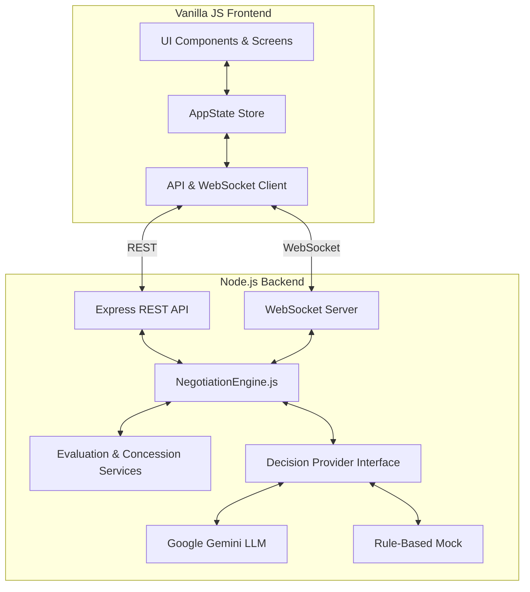

# NegoSim

**AI-Driven Multi-Agent Negotiation Training & Simulation Platform**

[Live Backend API: https://negosim-backend.onrender.com](https://negosim-backend.onrender.com)

---

## 📋 Table of Contents
- [Executive Overview](#-executive-overview)
- [Project Objectives](#-project-objectives)
- [Key Features](#-key-features)
- [System Architecture](#-system-architecture)
- [Feature Verification Matrix](#-feature-verification-matrix)
- [Getting Started](#-getting-started)
- [Known Limitations & Future Scope](#-known-limitations--future-scope)

---

## 📋 Executive Overview
**NegoSim** is an AI-driven multi-agent negotiation platform built to simulate complex bargaining scenarios and provide a training ground for human negotiators. 
- **Problem**: Negotiating effectively requires practice, but coordinating roleplay with experts is difficult and expensive.
- **Solution**: A system where LLM-powered agents (driven by Google Gemini) represent stakeholders with specific roles, goals, numeric constraints, and distinct personalities (e.g., Aggressive, Collaborative, Risk-Averse).
- **Capabilities**:
  - **Simulation Mode**: AI vs. AI autonomous negotiations for observation and analysis.
  - **Practice Mode (Human vs. AI)**: A human participant negotiates directly against an AI counterpart.
- **Key Technologies**: Vanilla JS/CSS3 (Frontend), Node.js/Express (Backend), WebSockets (Real-time events), Google Generative AI (LLM Reasoning), MongoDB (Prepared for auth/persistence).

---

## 🎯 Project Objectives
1. Provide a realistic, low-stakes environment for humans to practice negotiation.
2. Demonstrate autonomous AI-to-AI negotiation with constrained boundaries and distinct personality traits.
3. Ensure strict adherence to hard numeric constraints (e.g., maximum budget, minimum acceptable price) during LLM generation.
4. Deliver a highly responsive, real-time UI using WebSockets without the overhead of heavy frontend frameworks.

---

## ✨ Key Features

### 1. Scenario & Agent Configuration Wizard
- **Purpose**: Allow users to select predefined scenarios (e.g., Vendor Pricing, Job Offer, Budget Allocation) and configure agent personalities.
- **How it works**: Uses a modular Vanilla JS architecture with a reactive state store (`appState.js`).
- **Implementation**: The UI is card-based with CSS 3D tilt effects, driven by data in `js/data/scenarios.js`.

### 2. Autonomous LLM Reasoning Engine
- **Purpose**: Drive AI agent decisions logically based on context, history, and persona.
- **How it works**: The backend loops through turns, feeding context to the LLM and strictly parsing the JSON response for decisions, offers, spoken messages, internal reasoning, and parameters.
- **Implementation**: Built with Node.js and `@google/generative-ai`. `backend/engine/NegotiationEngine.js` orchestrates the loop. A rule-based mock engine (`backend/engine/decisionProvider.js`) acts as a fallback if the API is unavailable.

### 3. Practice Mode (Human vs. AI)
- **Purpose**: Allow a human user to step into the shoes of one agent to practice negotiation.
- **How it works**: The orchestration engine pauses execution on the human's turn. The frontend mounts an input panel to capture the user's message and offer, then sends it back via WebSocket.
- **Implementation**: `backend/engine/NegotiationEngine.js` implements a pause/resume callback pattern. `js/components/human-input.js` handles frontend UI and validation.

### 4. Real-Time Negotiation Arena
- **Purpose**: Display the live negotiation, offers, concessions, and AI internal reasoning as it happens.
- **How it works**: A WebSocket server shares the Express HTTP port, broadcasting events like `agent_message`, `offer_updated`, and `agent_thinking`.
- **Implementation**: The `LiveNegotiationScreen` (`js/screens/live-negotiation.js`) reacts to WS events to update DOM components seamlessly.

### 5. Advanced Deadlock & Agreement Detection
- **Purpose**: Autonomously resolve negotiations if agents stagnate or converge.
- **How it works**: The system checks for 1% offer convergence (auto-agreement) and dual-agent stagnation across N rounds.
- **Implementation**: `backend/services/evaluation.service.js` tracks round-over-round stagnation, emitting a non-terminating `deadlock_warning` before calling a hard deadlock.

---

## 🏗️ System Architecture


```mermaid
flowchart TD
    subgraph Frontend [Vanilla JS Frontend]
        UI[UI Components & Screens]
        State[AppState Store]
        API[API & WebSocket Client]
        
        UI <--> State
        State <--> API
    end

    subgraph Backend [Node.js Backend]
        HTTP[Express REST API]
        WS[WebSocket Server]
        Engine[NegotiationEngine.js]
        Eval[Evaluation & Concession Services]
        DecisionProvider[Decision Provider Interface]
        
        LLM[Google Gemini LLM]
        Mock[Rule-Based Mock]

        HTTP <--> Engine
        WS <--> Engine
        Engine <--> Eval
        Engine <--> DecisionProvider
        DecisionProvider <--> LLM
        DecisionProvider <--> Mock
    end

    API <-->|REST| HTTP
    API <-->|WebSocket| WS
```

---

## 🏆 Feature Verification Matrix

| Feature / Subsystem | Source File(s) | Status | Evidence / Description |
|---|---|---|---|
| Vanilla JS Component System | `js/app.js`, `js/state/appState.js` | ✅ IMPLEMENTED | Modular UI, `appState` reactive subscriber pattern. |
| Scenario Selection UI | `index.html`, `js/data/scenarios.js` | ✅ IMPLEMENTED | 3 scenarios defined, card-based selection in UI. |
| Autonomous Turn Engine | `backend/engine/NegotiationEngine.js` | ✅ IMPLEMENTED | `run()`, `executeTurn()`, pause/resume logic. |
| LLM Integration (Gemini) | `backend/services/llm.service.js` | ✅ IMPLEMENTED | `@google/generative-ai` used with fallback chain. |
| Rule-Based Fallback | `backend/engine/decisionProvider.js` | ✅ IMPLEMENTED | `RuleBasedDecisionProvider` handles turns without API keys. |
| Real-time WebSocket Updates | `backend/server.js`, `js/data/api.js` | ✅ IMPLEMENTED | `wss.handleUpgrade`, `ws.send`, real-time UI binding. |
| Practice Mode (Human Turn) | `js/components/human-input.js` | ✅ IMPLEMENTED | `submitHumanTurn`, `human_turn_required` WS event handling. |
| Advanced Deadlock Detection | `backend/services/evaluation.service.js` | ✅ IMPLEMENTED | `checkDeadlock()` tracks stagnation and issues warnings. |
| MongoDB / JWT Auth | `backend/routes/auth.routes.js`, `backend/server.js` | 🟡 PARTIALLY IMPLEMENTED | Routes exist, `mongoose.connect` runs, but frontend integration is pending. |
| Coaching Analytics/Scoring | N/A | 🚧 PLANNED | Planned feature for post-negotiation analysis. |
| PostgreSQL Persistence | N/A | 🚧 PLANNED | Mentioned in architecture context as future enhancement. |

---

## 🚀 Getting Started

### Prerequisites
- Node.js >= 18.0.0
- Google Gemini API Key (optional but recommended for LLM mode)
- MongoDB (optional, for auth)

### Backend Setup
1. Navigate to the `backend/` directory:
   ```bash
   cd backend
   ```
2. Install dependencies:
   ```bash
   npm install
   ```
3. Configure environment:
   Copy `.env.example` to `.env` and add your `GEMINI_API_KEY`.
4. Start the backend:
   ```bash
   npm run dev
   # or
   npm start
   ```
   *The server runs on HTTP and WS at `http://localhost:8001`.*

### Frontend Setup
1. Open a terminal in the repository root.
2. Start a static file server:
   ```bash
   python3 -m http.server 8000
   ```
3. Open `http://localhost:8000` in your browser.

*(Ensure `BASE_URL` and `WS_URL` in `js/data/api.js` match your backend deployment/local URL).*

---

## ⚠️ Known Limitations & Future Scope
- **In-Memory Storage**: Active sessions are currently stored in memory (`backend/services/negotiation.service.js`). Restarting the backend process will reset all active negotiations.
- **AI Typing Indicators**: Real-time streaming typing indicators are planned for a future release to improve immersion during Practice Mode.
- **Advanced Deadlock Handling**: Currently, the engine terminates after stagnation. Future updates will allow the AI to propose alternative packages before calling a hard deadlock.
- **Coaching Feedback**: A scoring and evaluation engine for human participants to receive actionable feedback is slated for development.
