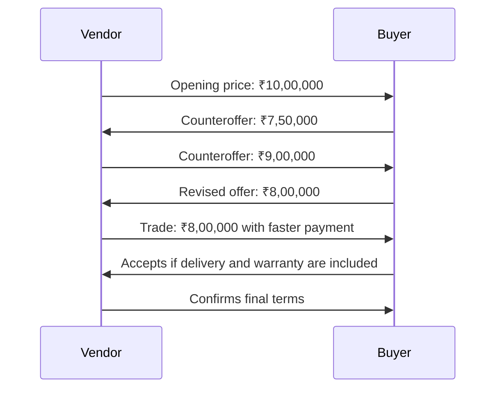

# Selected Negotiation Scenario

## Vendor Pricing Negotiation

The Buyer needs products for a company and is negotiating with the Vendor, who wants to maximize profit while closing the deal. The scenario uses a price range that makes agreement validation and concession tracking straightforward.

## Parties and Objectives

| Party | Objective | Constraint |
|---|---|---|
| Buyer | Purchase the required products at the lowest possible price while staying within budget | Maximum budget: **₹8,00,000** |
| Vendor | Achieve the highest acceptable selling price while closing the deal | Minimum acceptable price: **₹7,00,000** |

## Negotiation Terms

| Term | Buyer preference | Vendor preference |
|---|---|---|
| Total price | Target ₹7,40,000; maximum ₹8,00,000 | Opens at ₹10,00,000; minimum ₹7,00,000 |
| Quantity and quality | Full required quantity and agreed specification | Standard product specification |
| Delivery | Within 30 days | Up to 45 days unless expedited delivery is paid |
| Warranty | Two years included | One year standard; extended warranty as a trade |
| Payment | Payment after delivery | Partial advance payment |

## Example Negotiation

## Agreement Validation

An agreement is successful when:

- Total price is between ₹7,00,000 and ₹8,00,000.
- The required products and quality are explicitly specified.
- Delivery and warranty terms are recorded.
- Both Buyer and Vendor accept the complete package.

A possible agreement is **₹8,00,000**, delivery within **30 days**, a **two-year warranty**, and **30% advance with the balance on delivery**. The Buyer meets the budget limit and the Vendor meets its minimum acceptable price.

## Pre-built Scenario Catalogue

This scenario is the first of three templates planned for the platform:

1. Vendor Pricing Negotiation
2. Job Offer Negotiation
3. Project Budget Allocation
