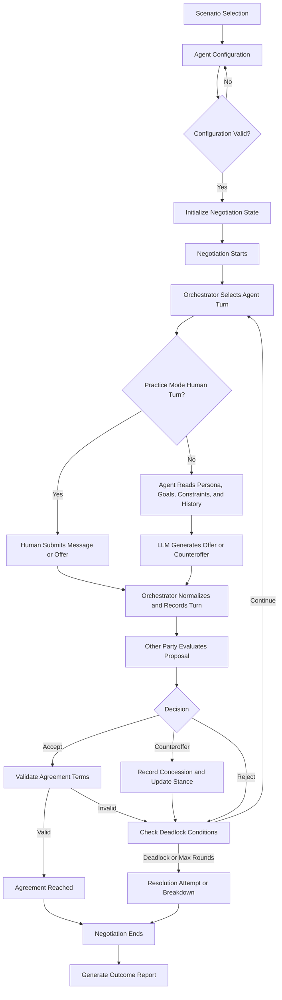
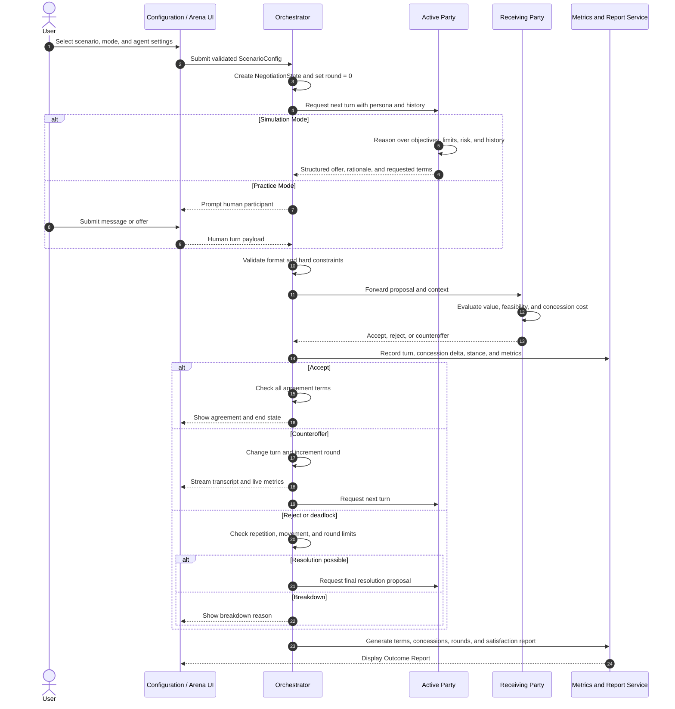
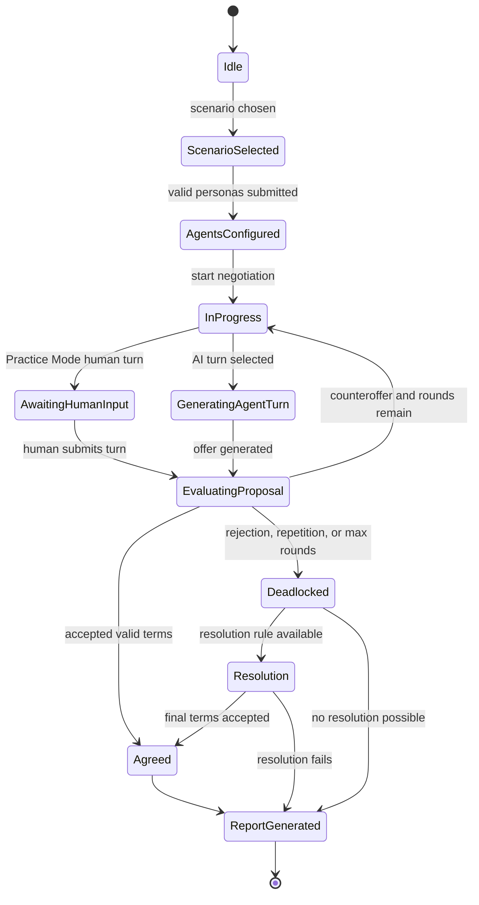
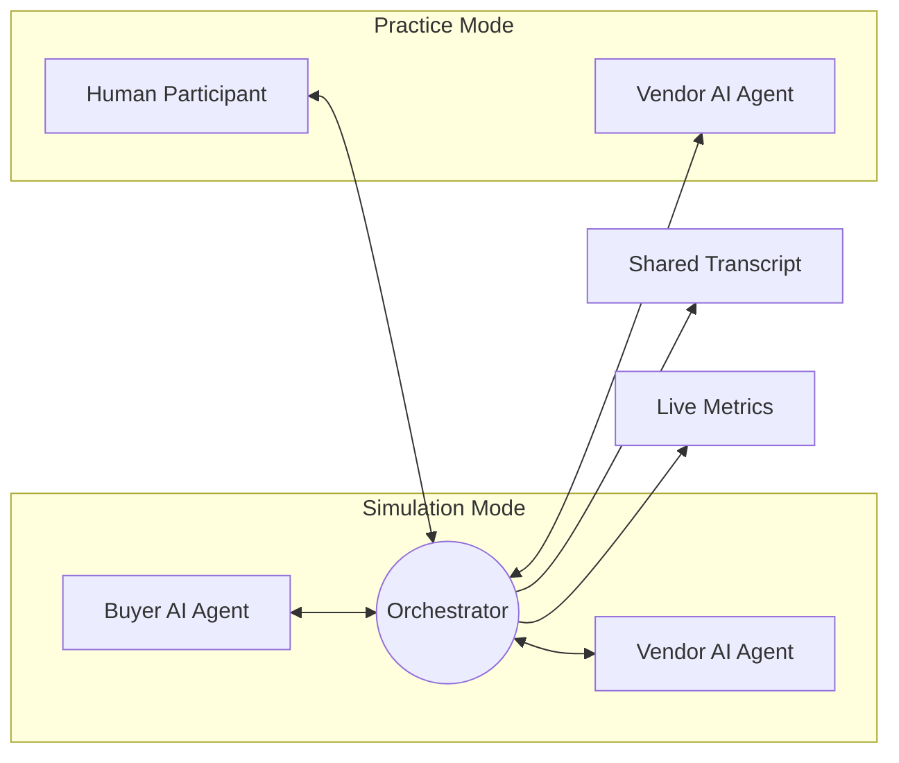

# System Workflow

This document defines the end-to-end workflow for the AI-Driven Multi-Agent Negotiation Training & Simulation Platform.

## 1. End-to-End Workflow

## 2. Detailed Round Sequence

## 3. Orchestrator State Machine

## 4. Stage Definitions

| Stage | System responsibility | Output |
|---|---|---|
| Scenario Selection | Load a pre-built scenario and its default terms | `ScenarioConfig` |
| Agent Configuration | Set role, goal, hard constraint, soft constraint, and personality | `AgentPersona[]` |
| Negotiation Starts | Create the transcript, round counter, turn order, and initial metrics | `NegotiationState` |
| Turn Selection | Choose the next party and supply current context | `TurnRequest` |
| Offer Generation | Produce a structured offer or response using the LLM | `Proposal` |
| Evaluation | Compare the proposal with objectives and constraints | `Decision` |
| State Update | Record terms, concessions, stance, and metrics | Updated `NegotiationState` |
| Deadlock Handling | Detect no movement, repeated offers, impossible constraints, or max rounds | `ResolutionResult` |
| Outcome Report | Summarize terms, performance, concessions, and result | `OutcomeReport` |

## 5. Deadlock Detection and Resolution

The Orchestrator checks for deadlock after every evaluated turn:

- The maximum configured round count is reached.
- The same offer or counteroffer is repeated.
- The distance between the parties has not reduced for several turns.
- A hard constraint makes a mutually acceptable agreement impossible.
- An agent rejects a proposal without a viable alternative.

When a deadlock is detected, the system can request a final package proposal, allow a trade across soft terms, or declare a breakdown with the blocking constraint recorded.

## 6. Simulation and Practice Modes

Both modes share the same state machine and report format. Practice Mode replaces one AI-generated turn with validated human input.
