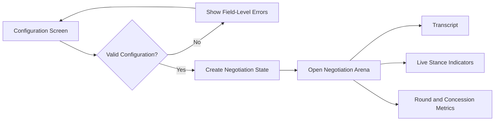

# Agent Configuration UI Wireframe

The configuration screen prepares the scenario and negotiating parties before the user enters the Negotiation Arena.

## Screen Wireframe

```text
+-----------------------------------------------------------------------+
|                  AI NEGOTIATION PLATFORM                             |
+-----------------------------------------------------------------------+
|                         AGENT CONFIGURATION                          |
|                                                                       |
| Scenario: [ Vendor Pricing Negotiation                         v ]   |
| Mode:     (x) Simulation       ( ) Practice                          |
|                                                                       |
+-------------------------------+---------------------------------------+
|             BUYER             |                 VENDOR                |
|                               |                                       |
| Name / Role: [ Buyer       ]  | Name / Role: [ Vendor              ]  |
|                               |                                       |
| Personality:                  | Personality:                         |
| [ Risk-averse            v ]  | [ Aggressive                  v ]   |
|                               |                                       |
| Goals:                        | Goals:                               |
| [ Get lowest possible price]  | [ Maximize profit and close deal]   |
|                               |                                       |
| Constraints:                  | Constraints:                         |
| [ Max ₹8,00,000            ]  | [ Min ₹7,00,000                    ]  |
|                               |                                       |
| [ Edit details ]              | [ Edit details ]                     |
+-------------------------------+---------------------------------------+
|                                                                       |
|                    [ START NEGOTIATION ]                             |
+-----------------------------------------------------------------------+
```

## Main Controls

| Control | Purpose |
|---|---|
| Scenario selector | Loads Vendor Pricing Negotiation, Job Offer Negotiation, or Project Budget Allocation |
| Mode selector | Chooses Simulation Mode or Practice Mode |
| Name / Role | Identifies the stakeholder and their responsibility |
| Personality selector | Chooses Aggressive, Collaborative, or Risk-averse behavior |
| Goals | Describes the outcome the agent is trying to achieve |
| Constraints | Records hard and soft limits used during evaluation |
| Start Negotiation | Validates the configuration and opens the Negotiation Arena |

## Validation Rules

- A scenario and mode must be selected.
- Both parties must have a role, goal, personality, and at least one constraint.
- Hard constraints must be explicit and measurable where possible.
- In Practice Mode, the human participant must be assigned to one party.
- The system must show a clear validation message before starting if a required field is missing.

## Arena Transition


